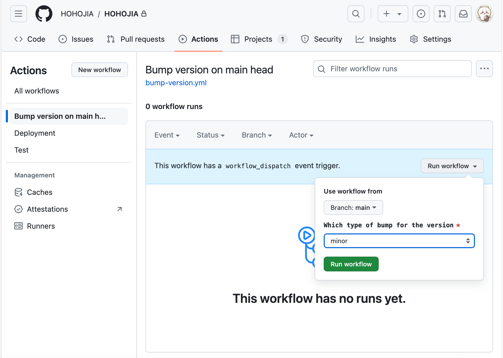
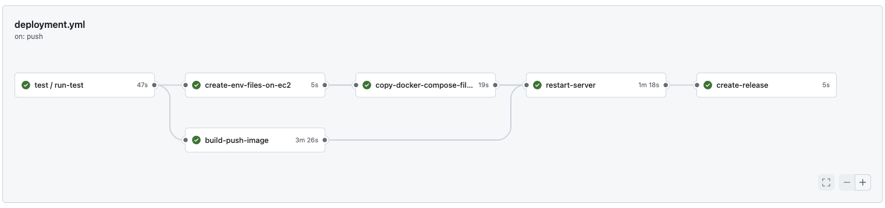

# Deployment
> [!NOTE]  
> 大家有什麼想法都可以提出來，一起完善 CD 流程 :bow:

## How to deploy?
要觸發 deployment workflow，需要打 tag 升版本，可以**擇一**使用以下方式，避免手動打 tag 或改版號時出錯

### 用 github action 升版本（推薦使用）
1. 先確認 code 已經 merge 進 main
2. 開 github 進到 repo 的 `action` tab，左邊選擇 Bump version on main head
3. 按右邊 `Run workflow`，選擇要升的版本部分是 major, minor 還是 patch
3. 執行後就會在 main 的 head 升版本
    - workflow 會打 tag，更改 `.version` 檔案，並 push 相關更動

### 用 bump_version.sh 升版本
> [!WARNING]  
> 推薦使用另一個方法，避免 local 端執行時 commit 到其他更動
>
> 還是應該把直接把這個方法移掉 :thinking:

1. 先確認 code 已經 merge 進 main
2. merge 完後，將 local 的 branch 切換到 main 的 head
3. :warning: 確認沒有尚未 commit 的 file，因為接下來會推 commit 跟 tag
4. 執行 `sh bump_version.sh`
    - `bump_version.sh`: 會打 tag，更改 `.version` 檔案，並 push 相關更動

## About deployment workflow

- Deployment workflow 會將 main 目前 code 部署到 server 上
- Deployment workflow 會在有 `v開頭` 的 tag 被 push 後觸發
    - 例如 `v1.0.0` 這個 tag 被 push
    - 所以要 deploy 時就升版，如何升版可以參考底下升版本方法
- Deployment workflow 會做：
    - 1. 跑一下 test
    - 2. 將 main head 目前前後端的 code build 成 docker image，並上傳到 gitlab
    - 3. 將要開 server 需要的檔案複製到我們的 AWS server 上
    - 4. 重開 server
    - 5. 在 github 上發一個 release（出現在我們 repo 的右邊）
- 詳細可以直接看 workflow 的定義： [/.github/workflows/deployment.yml](/.github/workflows/deployment.yml)
- 平常可以用 http://13.210.223.164/api/1.0/test 知道 server 的版本
